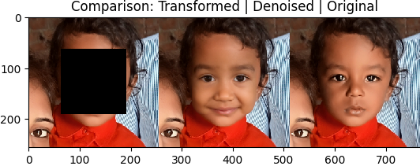
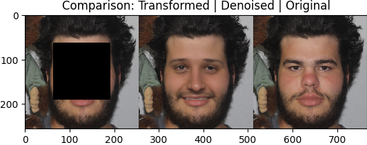
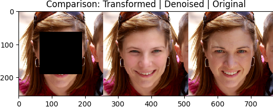
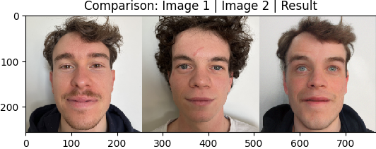

# Denoising Diffusion Models for Plug-and-Play Image Restoration

**Authors:** [Valentin Exbrayat](https://github.com/valdo92), [Hugo Pavy](https://github.com/hpavy)  
**Date:** March 2026

This repository contains an implementation of the **Denoising Diffusion Models for Plug-and-Play Image Restoration** architecture, originally proposed by Zhu et al. (2023). We focused on reimplementing the paper for inpainting task. Once it was done, we produced experiments on some parameters and we tried to change the Plug and Play algorithm from HQS to PGD.

```bibtex
@misc{zhu2023denoisingdiffusionmodelsplugandplay,
      title={Denoising Diffusion Models for Plug-and-Play Image Restoration}, 
      author={Yuanzhi Zhu and Kai Zhang and Jingyun Liang and Jiezhang Cao and Bihan Wen and Radu Timofte and Luc Van Gool},
      year={2023},
      eprint={2305.08995},
      archivePrefix={arXiv},
      primaryClass={cs.CV},
      url={https://arxiv.org/abs/2305.08995}, 
}
```

- [Denoising Diffusion Models for Plug-and-Play Image Restoration](#denoising-diffusion-models-for-plug-and-play-image-restoration)
    - [🔍 Overview](#-overview)
    - [😀 Some results](#-some-results)
    - [💻 Installation](#-installation)
    - [🚀 Minimal run snippet](#-minimal-run-snippet)
      - [For the DiffPIR](#for-the-diffpir)
      - [For the face swap algorithm](#for-the-face-swap-algorithm)


### 🔍 Overview

The goal of this work is to study the use of diffusion model for image inpainting in a Plug and Play (Pnp) framework. We reimplemented the architecture, following the code of the original repo: [link of the repo](https://github.com/yuanzhi-zhu/DiffPIR)

**Key Contributions:**
* **Easier implementation:** focusing only on inpainting
* **Other PnP method**: Instead of HQS we tried to use PGD method with our model.
* **Changing the DiffPIR**: Using the DIffPIR algorithm in order to create face swap.

You can find the report of our work in the file [report.pdf](report.pdf).

---
### 😀 Some results

**From DiffPIR**

You can see on the examples below that the PnP algorithm using the diffusion is well abled to generate realistic faces with inpainting problems.

<div align="center">
  
</div>

<div align="center">
  
</div>

<div align="center">
  
</div>


**Face Swap**

You can see below an example of the algorithm used in order to generate face swap. You can find how we made that in the report.

<div align="center">
  
</div>


---
### 💻 Installation

This project manages dependencies using **[Poetry](https://python-poetry.org)**.

**Install dependencies and environment:**

```
pip install poetry
poetry install
```

**Installing the diffusion model**

You can install the diffusion model using this [link](https://drive.google.com/drive/folders/1jElnRoFv7b31fG0v6pTSQkelbSX3xGZh). Then put it in the folder `model/`.

---

### 🚀 Minimal run snippet

#### For the DiffPIR

1) Configure `config.yaml` choosing the data and the hyperparameters.
* You need to put your data in the folder `data/`. 
* You need to write which data in this folder you want to use in a txt file. Then write the path of this file in config.

Example of the `config.yaml` file in order to write the path of the files: 

```
image_list_file: data/ffhq_100_val.txt
```

1) Run the main file (example):

```bash
poetry run python main.py
```
#### For the face swap algorithm

1) Configure `config_face_swap.yaml` choosing the data and the hyperparameters.
* You need to put your data in the folder `data/`. 


1) Run the main file for face swap (example):

```bash
poetry run python main_face_swap.py
```

